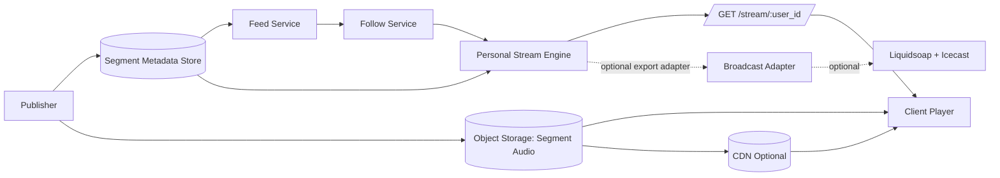

# Segment-Native Architecture (Migration Baseline)

## Intent

This document defines the default Subcastic runtime architecture after migration from broadcast-first infrastructure.

Subcastic core is now:
- segment data model
- feed graph and subscriptions
- per-user stream assembly
- HTTP playback API

Legacy broadcast infrastructure (Icecast/Liquidsoap) is optional and outside the critical path.

## Architecture Diagram

## Separation of Concerns

### Content Storage
- Segment metadata is stored independently from audio file bytes.
- `audio_url` points to object storage and is delivery-oriented.

### Stream Assembly Logic
- Stream engine is stateless compute over segment/feed/follow data.
- Ordering policy is deterministic for the same input state.

### Playback Delivery
- API returns queue metadata to clients.
- Audio bytes are served from object storage/CDN, not mixed in real time.

## Domain Boundaries

### Segment
Required fields:
- `segment_id`
- `feed_id`
- `publisher_id`
- `audio_url`
- `duration`
- `created_at`
- `metadata` (`title`, `description`, `tags`)

Optional provenance:
- `hash`
- `signature`
- `license`

### Feed
Required fields:
- `feed_id`
- `publisher_id`
- ordered `segment_ids`
- feed metadata (`name`, `description`, `type`)

### Follow
Required fields:
- `user_id`
- `followed_feed_ids`

Optional:
- feed weight/priority

### Stream Queue
- ordered list of segment objects
- produced by `Personal Stream Engine`
- returned by `GET /stream/:user_id`

## Runtime Characteristics

- No persistent mount-based stream daemon required for core product operation.
- Horizontal scaling comes from stateless stream assembly workers.
- Media delivery is cacheable static object serving.

## Legacy Compatibility

Legacy components are retained only for compatibility/export use cases:
- `icecast/`
- `liquidsoap/`
- broadcast-focused compose files

These modules are deprecated as required core runtime dependencies.
